# APEX_minimal – Einstieg und Projektdokumentation

APEX_minimal zeigt das Live-Bild einer Tiefenkamera als räumliche, farbige Oberfläche auf einem brillenlosen 3D-Display. Das Projekt ist ein Unity-Projekt mit genau einer Szene und zwei eigenen Skripten.

Diese Doku richtet sich an alle, die das Projekt übernehmen oder weiterentwickeln. Sie erklärt das Konzept, zeigt, wo im Unity-Editor was zu finden ist, und nennt die Stellschrauben.

**Stand:** 30.09.2026. Alle Werte in den Tabellen entsprechen der Szene `Assets/Scenes/APEX_minimal.unity`. Wo ein Screenshot davon abweicht, steht es dabei.

## Inhalt

- [APEX\_minimal – Einstieg und Projektdokumentation](#apex_minimal--einstieg-und-projektdokumentation)
  - [Inhalt](#inhalt)
  - [1. Das Konzept in Kürze](#1-das-konzept-in-kürze)
  - [2. Voraussetzungen](#2-voraussetzungen)
    - [Hardware](#hardware)
    - [Software](#software)
  - [3. Projekt holen und starten](#3-projekt-holen-und-starten)
    - [Prüfen, ob das 3D-Global-Paket da ist](#prüfen-ob-das-3d-global-paket-da-ist)
  - [4. Im Editor zurechtfinden](#4-im-editor-zurechtfinden)
    - [Projektstruktur](#projektstruktur)
  - [5. Die Szene](#5-die-szene)
    - [Die Testwürfel](#die-testwürfel)
  - [6. Main Camera: die 3D-Ausgabe](#6-main-camera-die-3d-ausgabe)
    - [G3D Camera](#g3d-camera)
    - [Camera](#camera)
    - [Orbit Loop](#orbit-loop)
  - [7. OrbbecSurface: das Live-Bild der Tiefenkamera](#7-orbbecsurface-das-live-bild-der-tiefenkamera)
    - [So arbeitet das Skript](#so-arbeitet-das-skript)
    - [Parameter](#parameter)
    - [Platzierung und Spiegelung](#platzierung-und-spiegelung)
    - [Material und Shader](#material-und-shader)
  - [8. Statische Objekte und Licht](#8-statische-objekte-und-licht)
    - [Gebackenes Licht](#gebackenes-licht)
  - [9. Build erstellen](#9-build-erstellen)
  - [10. Wo ändere ich was?](#10-wo-ändere-ich-was)
  - [11. Typische Fehler](#11-typische-fehler)
    - [„OrbbecSurface: Start fehlgeschlagen. Kamera an USB 3? Orbbec Viewer geschlossen?"](#orbbecsurface-start-fehlgeschlagen-kamera-an-usb-3-orbbec-viewer-geschlossen)
    - [Weitere Fehlerbilder](#weitere-fehlerbilder)
  - [12. Datenfluss im Detail](#12-datenfluss-im-detail)
    - [Quellen](#quellen)

---

## 1. Das Konzept in Kürze

Eine Tiefenkamera nimmt 30-mal pro Sekunde ein Farbbild und Infrarot-Rohdaten auf. Das Orbbec SDK berechnet daraus auf dem PC ein Tiefenbild, also für jeden Bildpunkt die Entfernung. Aus Farbbild und Tiefenbild zusammen entsteht eine farbige Oberfläche im Raum, ähnlich einer Reliefkarte. Diese Oberfläche wird in Unity geladen und laufend aktualisiert.

Das 3D-Display braucht nicht ein Bild, sondern acht leicht versetzte Ansichten derselben Szene. Ein Linsenraster auf dem Panel lenkt jede Ansicht in eine andere Richtung. Beide Augen sehen dadurch unterschiedliche Ansichten, und es entsteht Tiefe ohne Brille. Unity rendert die Szene deshalb aus acht virtuellen Kameras und verwebt die acht Bilder zu einem Bild für das Display.

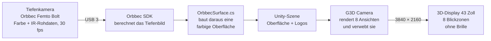
```mermaid
flowchart LR
    CAM["Tiefenkamera<br/>Orbbec Femto Bolt<br/>Farbe + IR-Rohdaten, 30 fps"]
    SDK["Orbbec SDK<br/>berechnet das Tiefenbild"]
    SURF["OrbbecSurface.cs<br/>baut daraus eine<br/>farbige Oberfläche"]
    SCENE["Unity-Szene<br/>Oberfläche + Logos"]
    G3D["G3D Camera<br/>rendert 8 Ansichten<br/>und verwebt sie"]
    DISP["3D-Display 43 Zoll<br/>8 Blickzonen<br/>ohne Brille"]
    CAM -->|USB 3| SDK --> SURF --> SCENE --> G3D -->|3840 × 2160| DISP
```

Das Projekt besteht aus drei Bausteinen:

| Baustein | Aufgabe | Herkunft |
|---|---|---|
| `OrbbecSurface.cs` | Kamerabilder holen und zur Oberfläche machen | eigenes Skript, `Assets/Scripts/` |
| `OrbitLoop.cs` | Kamerafahrt als Dauerschleife für Vorführungen | eigenes Skript, `Assets/Scripts/` |
| G3D Camera | 8 Ansichten rendern und für das Display verweben | Paket „3D Global Core" des Display-Herstellers |

Dazu kommen das Orbbec SDK, das die Kamera anspricht und das Tiefenbild berechnet, und ein eigener, sehr einfacher Shader für die Oberfläche.

**Ein Begriff, der überall auftaucht: die Fokusebene.** Sie ist die Ebene in der Szene, die der echten Displayoberfläche entspricht. Objekte auf der Fokusebene erscheinen auf der Glasscheibe. Objekte davor treten aus dem Display heraus, Objekte dahinter liegen im Display. In dieser Szene liegt die Fokusebene 2 m vor der Main Camera.

---

## 2. Voraussetzungen

### Hardware

| Gerät | Details |
|---|---|
| Tiefenkamera | Orbbec Femto Bolt, an einem **USB-3-Anschluss** |
| 3D-Display | 3D Global, 43 Zoll, 3840 × 2160, 8 Ansichten, Konfiguration `N8D` |
| Rechner | Windows, 64 Bit (die Orbbec-Bibliothek liegt nur als Windows-DLL vor) |

Laut Display-Konfiguration liegt der vorgesehene Betrachtungsabstand bei 2 m, zulässig sind 1,05 m bis 4,1 m.

### Software

| Software | Version | Hinweis |
|---|---|---|
| Unity Editor | **6000.3.24f1** (Unity 6.3 LTS) | über Unity Hub installieren, genau diese Version |
| Unity-Modul | Windows Build Support (IL2CPP) | nur für Builds nötig |
| Git | aktuell | Unity braucht Git auch, um das 3D-Global-Paket zu laden |
| **Git LFS** | aktuell | **vor dem Klonen installieren**, siehe unten |

Im Projekt bereits enthalten und nicht separat zu installieren:

- Universal Render Pipeline (URP) 17.3.0
- 3D Global Core 0.6.0, eingebunden per Git-URL
- Orbbec SDK v2: C#-Wrapper 2.4.0 in `Assets/OrbbecSDK/Scripts/`, native Bibliothek 2.4.3 in `Assets/OrbbecSDK/Plugins/` und `Assets/StreamingAssets/OrbbecSDK/`

> **Git LFS ist Pflicht.** Die `.dll`-, `.png`- und `.fbx`-Dateien des Projekts liegen in Git LFS. Ausgenommen sind nur die Bilder dieser Doku. Ohne Git LFS landen beim Klonen nur winzige Platzhalterdateien auf der Platte. Die Kamera-Bibliothek `OrbbecSDK.dll` ist dann 132 Byte groß und nicht ladbar.

---

## 3. Projekt holen und starten

1. Git LFS einmalig einrichten:

   ```bash
   git lfs install
   ```

2. Repository klonen:

   ```bash
   git clone https://github.com/dlfl96/APEX_minimal.git
   ```

3. In Unity Hub über **Add** den geklonten Ordner hinzufügen und mit Editor 6000.3.24f1 öffnen.

   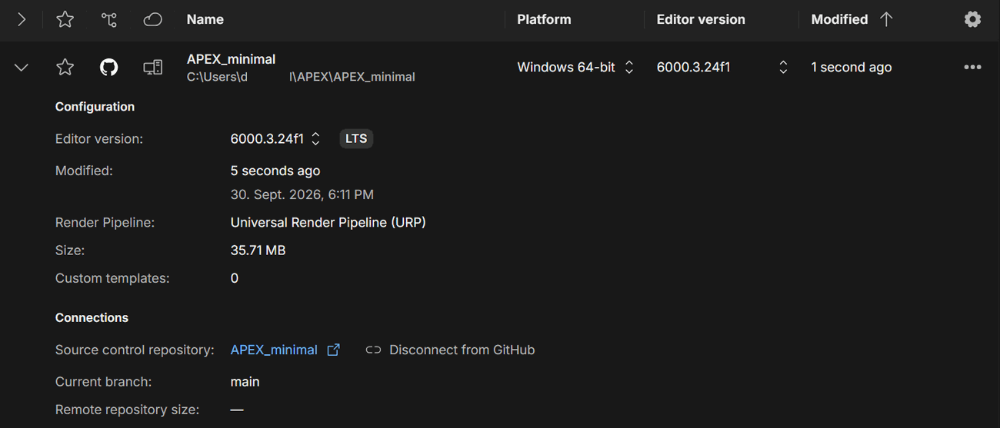

   Das erste Öffnen dauert einige Minuten. Unity importiert alle Assets und lädt das 3D-Global-Paket von GitHub. Dafür ist eine Internetverbindung nötig.

4. Die Szene öffnen: im Project-Fenster `Assets/Scenes/APEX_minimal` doppelklicken. `SampleScene` ist ein Rest der Unity-Vorlage und wird nicht verwendet.

   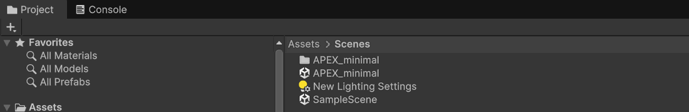

5. Kamera an USB 3 anschließen. Den Orbbec Viewer schließen, falls er läuft. Die Kamera kann nur von einem Programm gleichzeitig geöffnet werden.

6. Oben in der Mitte auf **Play** klicken. In der Console erscheint beim ersten Kamerabild eine Zeile wie `OrbbecSurface: Punktwolke 640x576, decimation 1 -> Gitter 640x576, … Dreiecke`.

Der 3D-Eindruck entsteht nur auf dem 3D-Display selbst. Das verwobene Bild muss dort pixelgenau in der nativen Auflösung 3840 × 2160 ankommen. Für Vorführungen ist deshalb ein Build im Vollbild der sichere Weg, siehe [Abschnitt 9](#9-build-erstellen).

### Prüfen, ob das 3D-Global-Paket da ist

**Window > Package Management > Package Manager** öffnen. Unter „In Project" muss „3D Global Core" stehen.

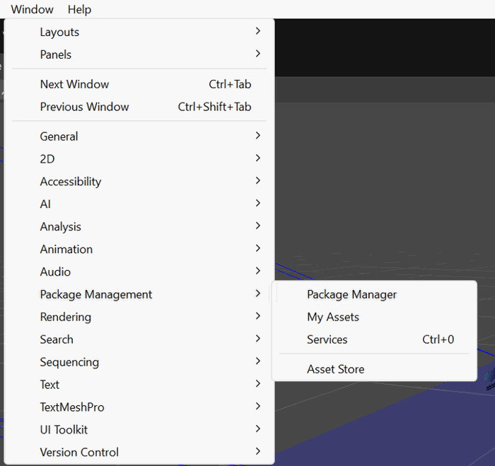

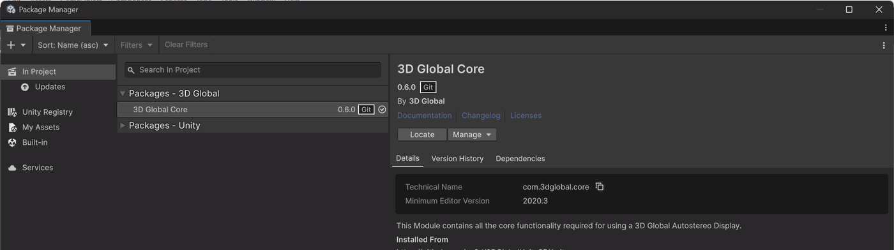

Das Paket kommt von `https://github.com/ux3d/3DGlobalUnitySDK.git`. Die Datei `Packages/packages-lock.json` hält den genauen Stand fest, mit dem das Projekt zuletzt lief. Der Link „Documentation" führt zur Beschreibung des Herstellers.

---

## 4. Im Editor zurechtfinden

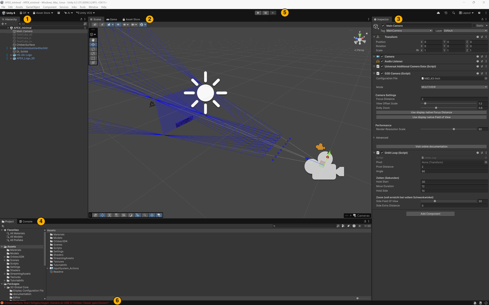

| Nr. | Bereich | Wofür |
|---|---|---|
| 1 | **Hierarchy** | Alle Objekte der Szene. Ein Klick wählt ein Objekt aus. |
| 2 | **Scene / Game** | Scene ist die frei drehbare Arbeitsansicht. Game zeigt, was die Kamera ausgibt. |
| 3 | **Inspector** | Alle Einstellungen des ausgewählten Objekts. Hier stehen die Parameter der Skripte. |
| 4 | **Project / Console** | Project zeigt die Dateien des Projekts. Console zeigt Meldungen und Fehler. |
| 5 | **Play** | Startet und stoppt die Szene im Editor. |
| 6 | **Statuszeile** | Zeigt die letzte Meldung der Console. Rot bedeutet Fehler. |

Im Bild ist die Statuszeile rot, weil beim Aufnehmen keine Kamera angeschlossen war. Die Meldung ist in [Abschnitt 11](#11-typische-fehler) erklärt.

> Änderungen im Inspector während **Play** gehen beim Stoppen verloren. Werte, die bleiben sollen, im gestoppten Zustand eintragen und die Szene mit Strg+S speichern. Ein Stern hinter dem Szenennamen (`APEX_minimal*`) bedeutet ungespeicherte Änderungen.

### Projektstruktur

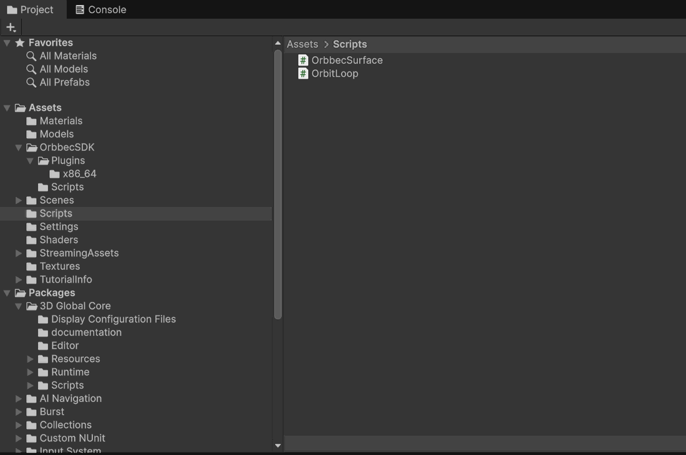

| Ordner | Inhalt |
|---|---|
| `Assets/Scenes/` | Die Szene `APEX_minimal`, dazu der gleichnamige Ordner mit den gebackenen Lightmaps und die Lighting-Einstellungen |
| `Assets/Scripts/` | Die beiden eigenen Skripte `OrbbecSurface` und `OrbitLoop` |
| `Assets/Shaders/` | Der Shader `PointCloudVertexColor` für die Kamera-Oberfläche |
| `Assets/Materials/` | Materialien für Oberfläche, Schild, Logos und Testwürfel |
| `Assets/Models/` | 3D-Modelle: Schild „Zentrum Industrie 4.0", Hochschul-Logo, APEX-Logo |
| `Assets/Textures/` | Farbverlauf für das Hochschul-Signet |
| `Assets/OrbbecSDK/` | Orbbec SDK: C#-Wrapper und `OrbbecSDK.dll` |
| `Assets/StreamingAssets/OrbbecSDK/` | Erweiterungen des Orbbec SDK, darunter `depthengine.dll`. Sie berechnet das Tiefenbild, ohne sie liefert die Kamera keine Tiefe. Die optionalen Filter unter `extensions/filters` liegen bereit, werden aber nicht genutzt. |
| `Assets/StreamingAssets/G3DHTService/` | Head-Tracking-Dienst des 3D-Global-Pakets. Wird vom Paket automatisch angelegt und im hier genutzten Multiview-Modus nicht gebraucht. |
| `Assets/Settings/` | URP-Einstellungen. Aktiv ist das Profil „PC". |
| `Assets/TutorialInfo/`, `Readme` | Reste der Unity-Vorlage, ohne Funktion |
| `Packages/` | Paketliste. Unter „3D Global Core" liegen auch die Display-Konfigurationsdateien. |

---

## 5. Die Szene

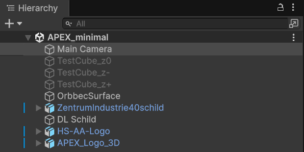

| Objekt | Was es ist | Position (x, y, z) in m |
|---|---|---|
| **Main Camera** | Ausgangspunkt der 3D-Ausgabe, trägt `G3D Camera` und `Orbit Loop` | 0, 0, 0 |
| TestCube_z0, z-, z+ | Drei Testwürfel zum Prüfen der Tiefenwirkung, **deaktiviert** | z = 2,0 / 1,5 / 2,5 |
| **OrbbecSurface** | Die Live-Oberfläche aus der Tiefenkamera | 0, 0,2, 1,3 |
| ZentrumIndustrie40schild | Schild als 3D-Modell | −0,17, −0,11, 2,01 |
| DL Schild | Richtungslicht für die statischen Objekte, gebacken | – |
| HS-AA-Logo | Logo der Hochschule Aalen | 0,38, 0,20, 2,0 |
| APEX_Logo_3D | APEX-Logo | −0,46, 0,20, 2,0 |

Ausgegraute Namen sind deaktivierte Objekte. Blaue Namen sind importierte 3D-Modelle.

Schild und Logos stehen bei z ≈ 2 m und damit genau auf der Fokusebene. Sie erscheinen auf der Displayoberfläche und bilden einen ruhigen Rahmen, vor und hinter dem sich die Live-Oberfläche abhebt.

### Die Testwürfel

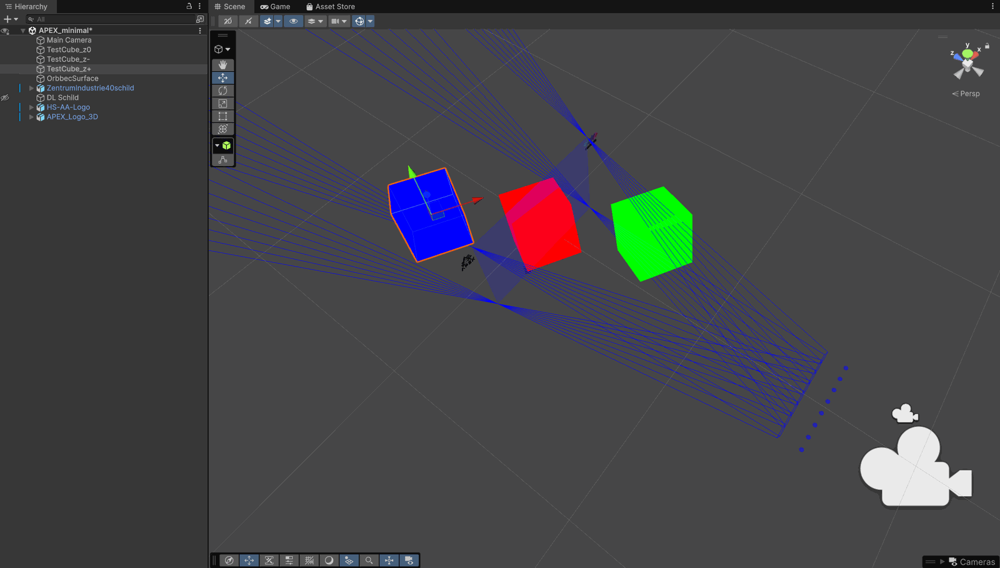

Die drei Würfel sind 30 cm groß und stehen in drei Tiefen. Der rote Würfel (`z0`) steht auf der Fokusebene, der grüne (`z-`) 50 cm davor, der blaue (`z+`) 50 cm dahinter. Auf dem Display muss der grüne Würfel heraustreten und der blaue zurückliegen. Damit lässt sich die 3D-Ausgabe ohne Tiefenkamera prüfen.

Zum Einschalten einen Würfel in der Hierarchy anklicken und im Inspector das Häkchen links neben dem Namen setzen. Im Repository sind die Würfel deaktiviert, im Screenshot sind sie für die Aufnahme eingeschaltet.

---

## 6. Main Camera: die 3D-Ausgabe

Die Main Camera rendert selbst nichts. Sie gibt nur Position, Blickrichtung und Bildwinkel vor. Das Skript **G3D Camera** erzeugt beim Start acht Teilkameras als Kinder der Main Camera, rendert die Szene aus jeder davon und verwebt die acht Bilder für das Display.

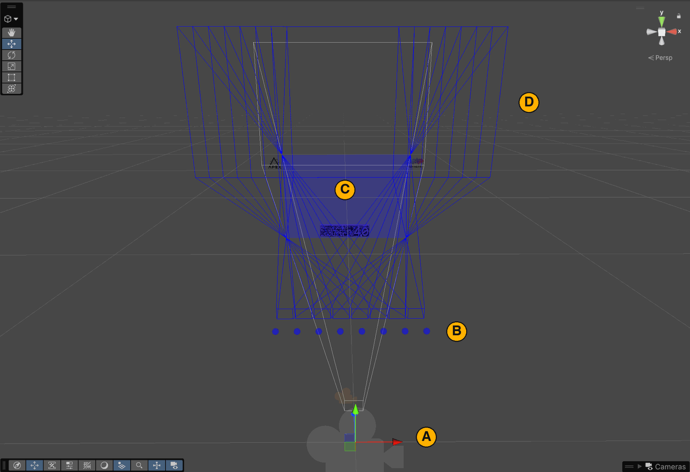

| Marke | Bedeutung |
|---|---|
| A | Main Camera |
| B | Die Positionen der acht Teilkameras |
| C | Die Fokusebene (blaue Fläche). Hier liegen Schild und Logos. |
| D | Die Sichtkegel der acht Teilkameras. Sie decken sich genau auf der Fokusebene. |

Die blauen Linien sind nur Hilfsgrafiken im Editor. Sie lassen sich über „Show Gizmos" abschalten.

### G3D Camera

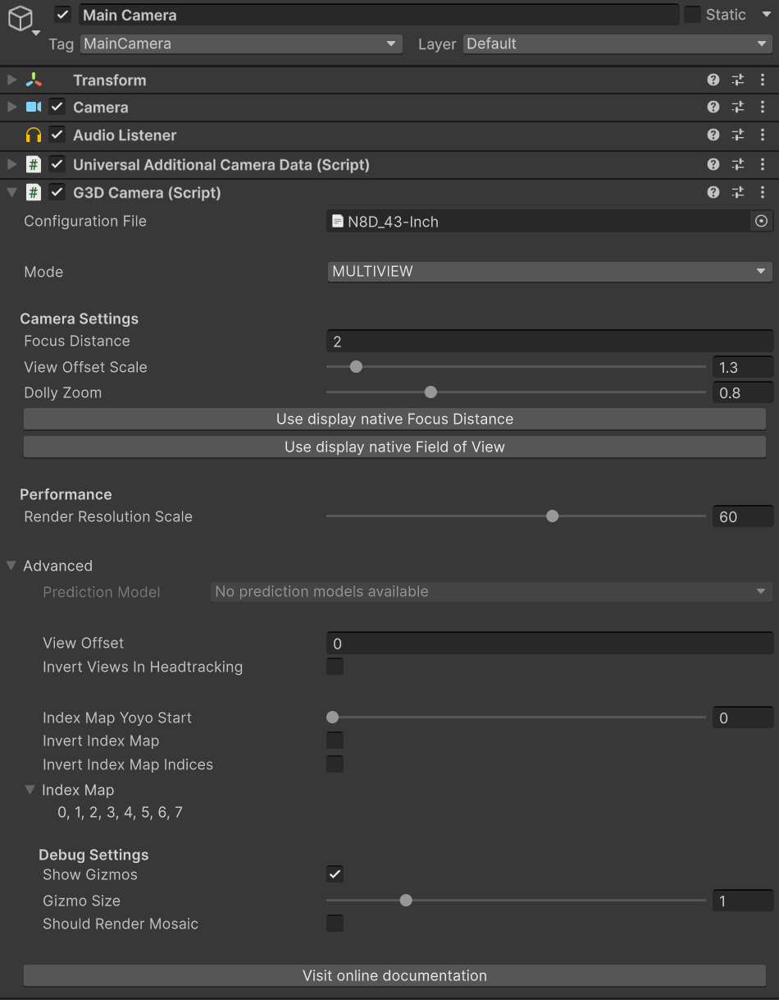

| Parameter | Wert | Bedeutung |
|---|---|---|
| Configuration File | `N8D_43-Inch` | Beschreibt das Display: Auflösung, Zahl der Ansichten, Linsengeometrie. Muss zum angeschlossenen Display passen. |
| Mode | `MULTIVIEW` | Feste Ansichten ohne Head-Tracking. Mehrere Personen können gleichzeitig schauen. |
| Focus Distance | 2 | Abstand der Fokusebene vor der Main Camera in Metern |
| View Offset Scale | 1,3 | Abstand der Teilkameras zueinander. Größer bedeutet mehr Tiefenwirkung, aber auch mehr Doppelbilder bei Objekten weit vor oder hinter der Fokusebene. |
| Dolly Zoom | 0,8 | Rückt die Teilkameras näher an die Fokusebene und weitet dabei den Bildwinkel. 1 bedeutet keine Änderung. |
| Render Resolution Scale | 100 | Auflösung jeder einzelnen Ansicht in Prozent der Displayauflösung. 100 bedeutet: jede Ansicht in vollen 3840 × 2160. Kleiner bedeutet schneller. Die Auflösung des fertigen Bildes bleibt gleich. |

> Der Screenshot zeigt noch den früheren Wert 60 für Render Resolution Scale.

Unter **Advanced**:

| Parameter | Wert | Bedeutung |
|---|---|---|
| View Offset | 0 | Verschiebt die Zuordnung der Ansichten zu den Blickzonen |
| Index Map | 0 bis 7 | Reihenfolge der acht Ansichten |
| Show Gizmos | an | Hilfsgrafiken in der Scene-Ansicht |
| Should Render Mosaic | aus | Zeigt zur Fehlersuche alle acht Ansichten als Kacheln nebeneinander statt verwoben |

Die beiden Knöpfe „Use display native …" setzen Fokusabstand und Bildwinkel auf die Werte aus der Display-Konfiguration zurück.

Mit den eingestellten Werten stehen die Teilkameras 1,6 m vor der Fokusebene und rund 6 cm auseinander. Das ergibt sich aus Focus Distance × Dolly Zoom und aus der Display-Konfiguration × View Offset Scale.

### Camera

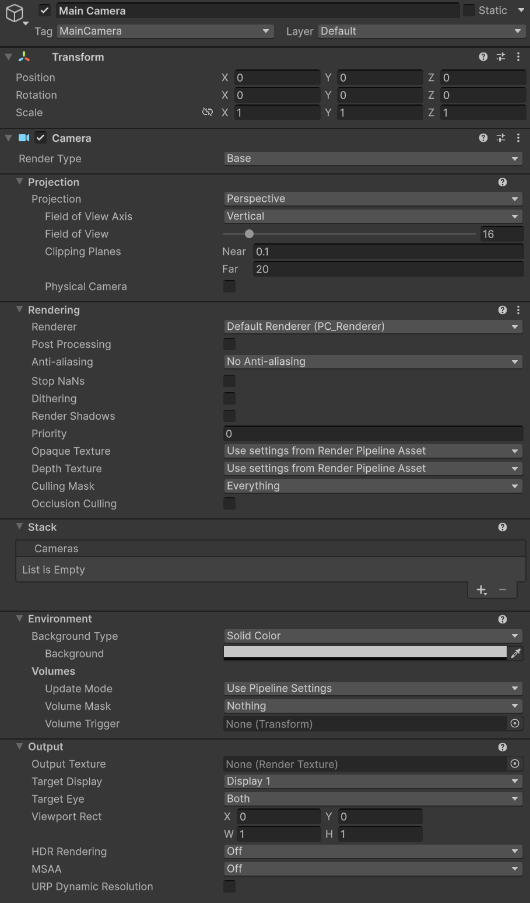

Wichtig sind nur wenige Werte:

| Parameter | Wert | Bedeutung |
|---|---|---|
| Field of View | 16 | Vertikaler Bildwinkel in Grad. Wird an die Teilkameras weitergegeben. |
| Clipping Planes | 0,1 bis 20 | Sichtbarer Tiefenbereich in Metern |
| Background | einfarbig hellgrau | Hintergrund der Szene |
| Post Processing, Anti-aliasing, Render Shadows | aus | Bewusst abgeschaltet, um Rechenzeit zu sparen |

### Orbit Loop

`OrbitLoop.cs` bewegt die Main Camera in einer Endlosschleife: Startansicht halten, langsam um einen Drehpunkt zur Seite schwenken und dabei den Bildwinkel öffnen, kurz halten, zurückschwenken. Die acht Teilkameras hängen an der Main Camera und fahren mit. Die Schleife ist für Vorführungen gedacht und zeigt, dass die Oberfläche wirklich räumlich ist.

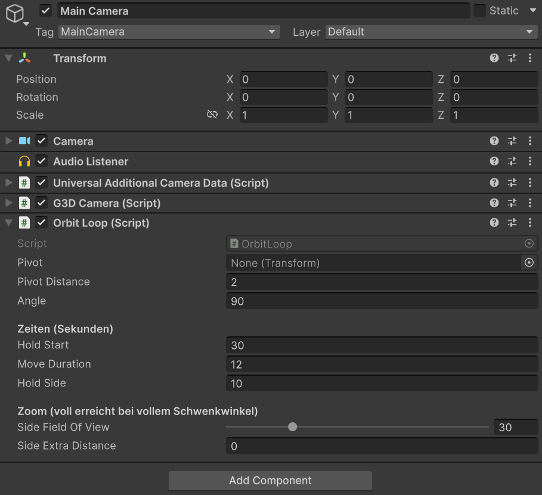

| Parameter | Wert | Bedeutung |
|---|---|---|
| Pivot | leer | Drehpunkt. Leer bedeutet: der Punkt „Pivot Distance" vor der Startposition. |
| Pivot Distance | 2 | Abstand des Drehpunkts in Metern. 2 m entspricht der Fokusebene. |
| Angle | 90 | Schwenkwinkel in Grad. Negativ schwenkt zur anderen Seite. |
| Hold Start | 30 | Sekunden in der Startansicht |
| Move Duration | 12 | Sekunden für einen Schwenk, hin oder zurück |
| Hold Side | 10 | Sekunden in der Seitenansicht |
| Side Field Of View | 30 | Bildwinkel in der Seitenansicht. Er wächst während des Schwenks von 16° auf 30°. |
| Side Extra Distance | 0 | Zusätzlicher Abstand in der Seitenansicht in Metern |

Ein Durchlauf dauert 30 + 12 + 10 + 12 = 64 Sekunden.

Für eine feste Ansicht ohne Kamerafahrt das Häkchen vor „Orbit Loop (Script)" entfernen.

---

## 7. OrbbecSurface: das Live-Bild der Tiefenkamera

Das Objekt `OrbbecSurface` trägt das Skript `OrbbecSurface.cs`. Es öffnet die Kamera, holt die Bilder und baut daraus 30-mal pro Sekunde ein neues Dreiecksnetz.

### So arbeitet das Skript

1. **Bilder holen.** Das Orbbec SDK hat aus den Rohdaten der Kamera bereits das Tiefenbild mit 640 × 576 Pixeln berechnet und das Farbbild mit 1280 × 720 Pixeln dekodiert. Das Skript holt beide als zeitlich synchrones Paar ab.
2. **Ausrichten.** Eine Funktion des Orbbec SDK rechnet das Farbbild in die Perspektive der Tiefenkamera um. Danach hat jeder Tiefenpunkt eine Farbe.
3. **Punkte berechnen.** Eine weitere SDK-Funktion macht aus jedem Rasterpunkt und seiner Entfernung einen Punkt im Raum, mit Position in Metern und Farbe.
4. **Ausdünnen, falls eingestellt.** Eingestellt ist `Decimation` 1, also volle Auflösung mit 640 × 576 Punkten. Bei 2 würde nur jede zweite Zeile und Spalte verwendet, dann wären es 320 × 288.
5. **Dreiecke bilden.** Je vier benachbarte Rasterpunkte ergeben zwei Dreiecke. Das gilt nur, wenn alle vier Punkte im Tiefenfenster liegen und kein Tiefensprung zwischen ihnen ist.
6. **Anzeigen.** Das fertige Netz wird an Unity übergeben.

Schritt 5 ist der Kern. Das Tiefenfenster (`Near`, `Far`) schneidet Hintergrund und zu nahe Objekte weg. Die Kantenschwelle (`Edge Threshold`) verhindert, dass zwischen einer Person im Vordergrund und der Wand dahinter eine verzerrte „Gummihaut" entsteht.

Die Schritte 1 bis 5 laufen in einem eigenen Thread im Takt der Kamera. Unity übernimmt pro Bild nur das jeweils neueste fertige Netz. Eine langsame Kamera bremst die Darstellung deshalb nicht aus, und eine langsame Darstellung staut keine Kamerabilder.

### Parameter

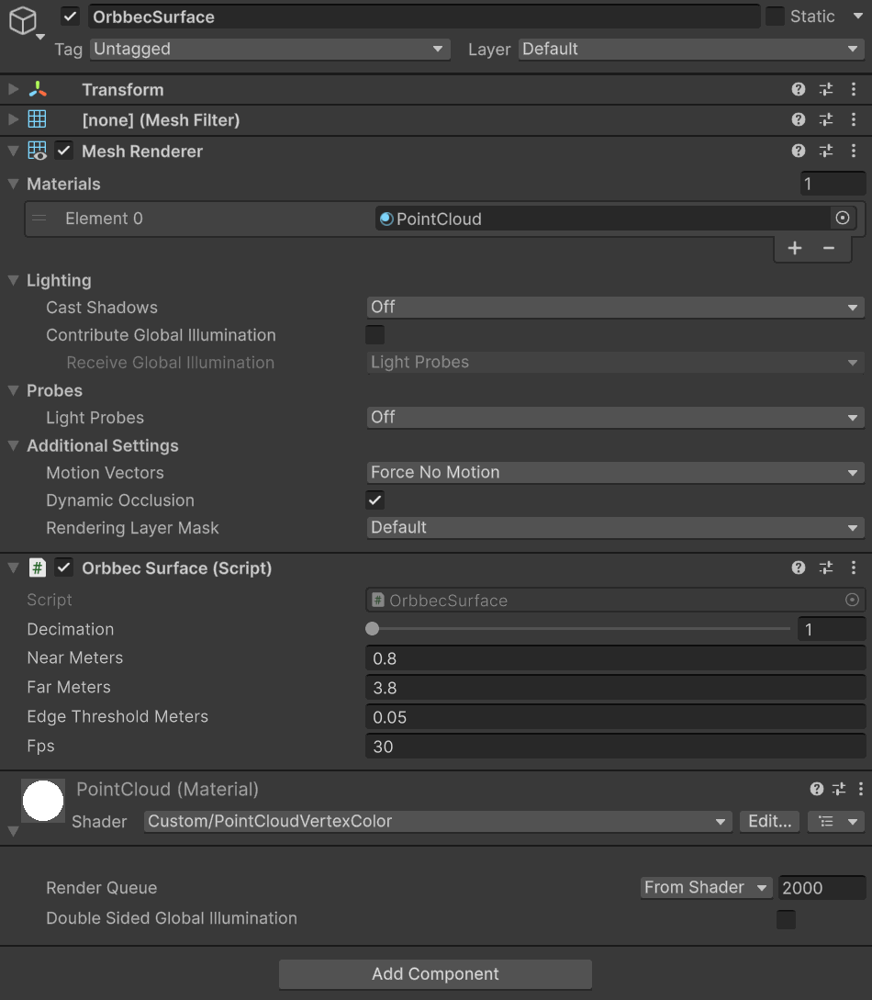

| Parameter | Wert | Bedeutung |
|---|---|---|
| Decimation | 1 | 1 = volle Auflösung, 2 = jede zweite Zeile und Spalte, bis 4. Höher läuft flüssiger, wird aber gröber. |
| Near Meters | 0,8 | Vordere Grenze des Tiefenfensters, gemessen ab Kamera |
| Far Meters | 3,8 | Hintere Grenze des Tiefenfensters |
| Edge Threshold Meters | 0,05 | Größter Tiefensprung innerhalb einer Masche, bei dem noch Fläche entsteht |
| Fps | 30 | Bildrate der Kamera: 5, 15 oder 30. Wirkt nur beim Start. |

> **Qualität vor Tempo.** Die Szene ist auf volle Auflösung eingestellt: Decimation 1 und Render Resolution Scale 100. Als Build läuft das auf dem Vorführrechner flüssig. Im Editor kann es ruckeln, weil der Editor selbst Rechenzeit braucht. Auf einem schwächeren Rechner zuerst Decimation auf 2 und Render Resolution Scale auf 60 stellen. Das war die frühere Einstellung. Zu beachten: Auch die Tiefenberechnung der Kamera läuft auf der Grafikkarte und teilt sie sich mit dem Rendern der acht Ansichten, siehe [Abschnitt 12](#12-datenfluss-im-detail).

Die Werte im Inspector überschreiben die Vorgaben im Code. Wer das Skript auf ein neues Objekt legt, startet mit den Code-Vorgaben (Decimation 2, Near 0,5, Far 3,0, Fps 15).

### Platzierung und Spiegelung

Position, Größe und Spiegelung der Oberfläche stehen nicht im Skript, sondern im **Transform** des Objekts:

| Transform | Wert | Wirkung |
|---|---|---|
| Position | 0, 0,2, 1,3 | Schiebt die Oberfläche 1,3 m nach hinten und 20 cm nach oben |
| Rotation | 20, 0, 0 | Neigt sie um 20° |
| Scale | **−0,6**, 0,6, 0,6 | Verkleinert auf 60 %. Das Minus bei x spiegelt horizontal, wie bei einem Spiegel. |

Daraus folgt eine Faustregel: Wer rund 1,2 m vor der Kamera steht, landet in der Szene ungefähr auf der Fokusebene und damit auf der Displayoberfläche. Wer näher herangeht, tritt aus dem Display heraus.

### Material und Shader

Die Oberfläche nutzt das Material `PointCloud` mit dem Shader `Custom/PointCloudVertexColor` (`Assets/Shaders/PointCloudVertexColor.shader`). Der Shader ist bewusst minimal:

- Er gibt nur die Farbe aus, die jeder Punkt von der Kamera mitbringt. Licht und Schatten der Szene wirken nicht auf die Oberfläche.
- Er zeichnet beide Seiten der Fläche (`Cull Off`), damit sie aus allen acht Blickwinkeln sichtbar bleibt.
- Er rechnet die Kamerafarben von sRGB nach linear um. Ohne diesen Schritt wirken die Farben blass.

Weil jede Ansicht achtmal gerendert wird, zählt hier jede eingesparte Rechenoperation.

---

## 8. Statische Objekte und Licht

Schild und Logos sind importierte 3D-Modelle aus `Assets/Models/`. Ihre Materialien liegen in `Assets/Materials/`. Die Zuordnung steht im Inspector des Modells im Reiter **Materials**. Beim Schild sind alle vier Teilkörper auf das Material `Schild` gelegt.

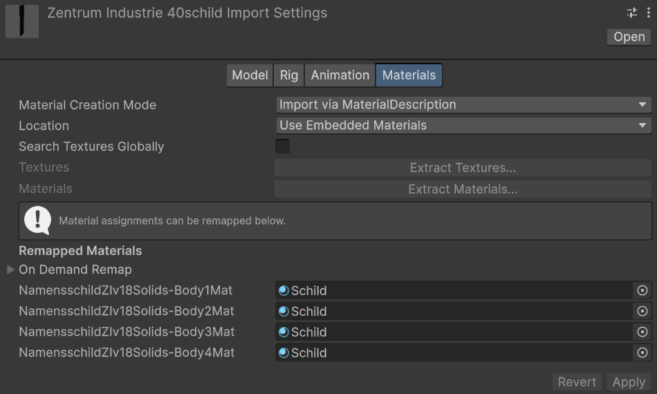

### Gebackenes Licht

Die statischen Objekte werden vom Richtungslicht `DL Schild` beleuchtet. Das Licht steht auf **Mode: Baked**. Unity berechnet Licht und Schatten einmal im Voraus und speichert das Ergebnis als Textur (Lightmap). Zur Laufzeit kostet das Licht dann keine Rechenzeit. Das ist hier wichtig, weil jede Ansicht achtmal gerendert wird.

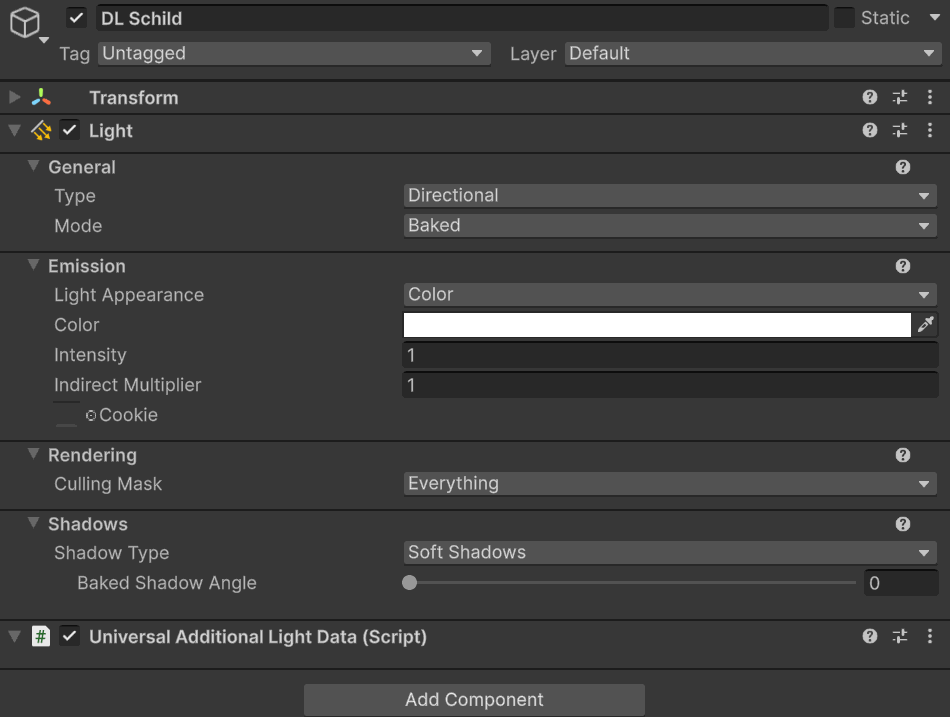

Die Lightmaps liegen in `Assets/Scenes/APEX_minimal/`. Die Live-Oberfläche der Kamera ist davon nicht betroffen.

**Nach jeder Änderung an Licht oder statischen Objekten muss neu gebacken werden.** Das gilt für Position, Drehung, Größe und Material. Sonst passen Licht und Schatten nicht mehr zum Objekt.

1. **Window > Rendering > Lighting** öffnen.

   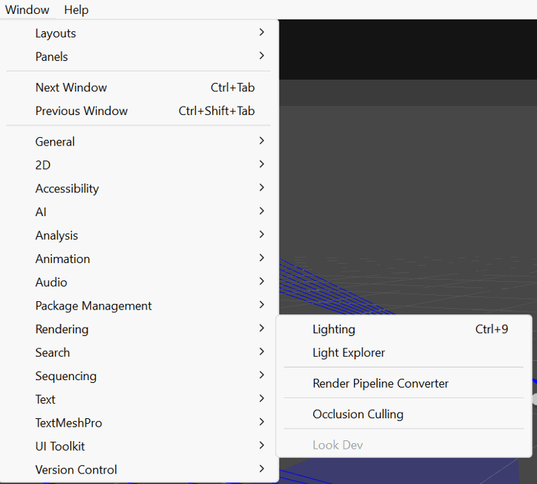

2. Unten auf **Generate Lighting** klicken und warten, bis die Berechnung fertig ist.

   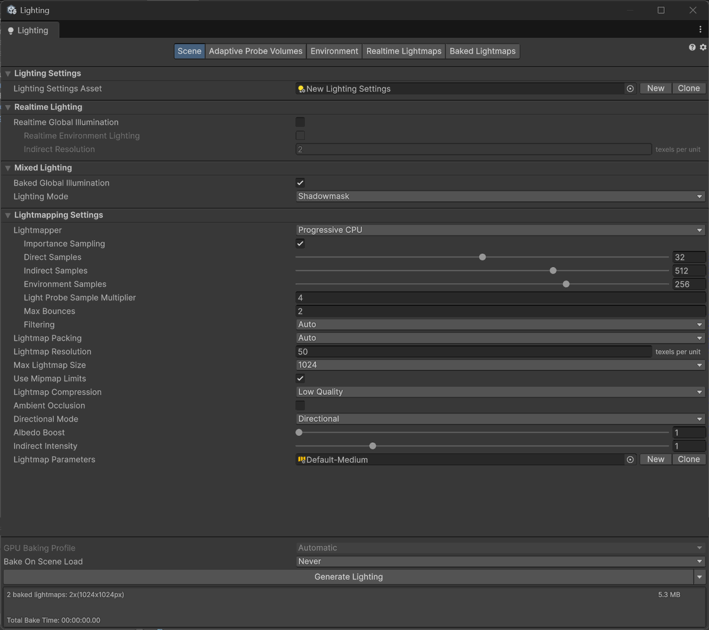

3. Szene speichern und die geänderten Dateien in `Assets/Scenes/APEX_minimal/` mit committen.

Ein neues statisches Objekt nimmt nur am Backen teil, wenn im Inspector oben rechts **Static** angehakt ist.

---

## 9. Build erstellen

Ein Build ist das fertige Programm, das ohne Unity-Editor läuft. Für Vorführungen am Display ist das der normale Weg.

1. **File > Build Profiles** öffnen.

   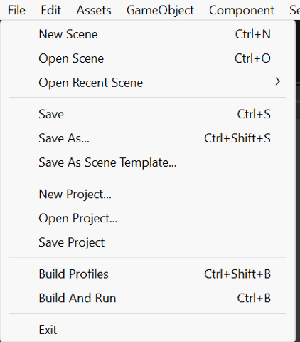

2. Prüfen: Plattform **Windows** ist aktiv, in der Scene List ist nur `Scenes/APEX_minimal` angehakt.

   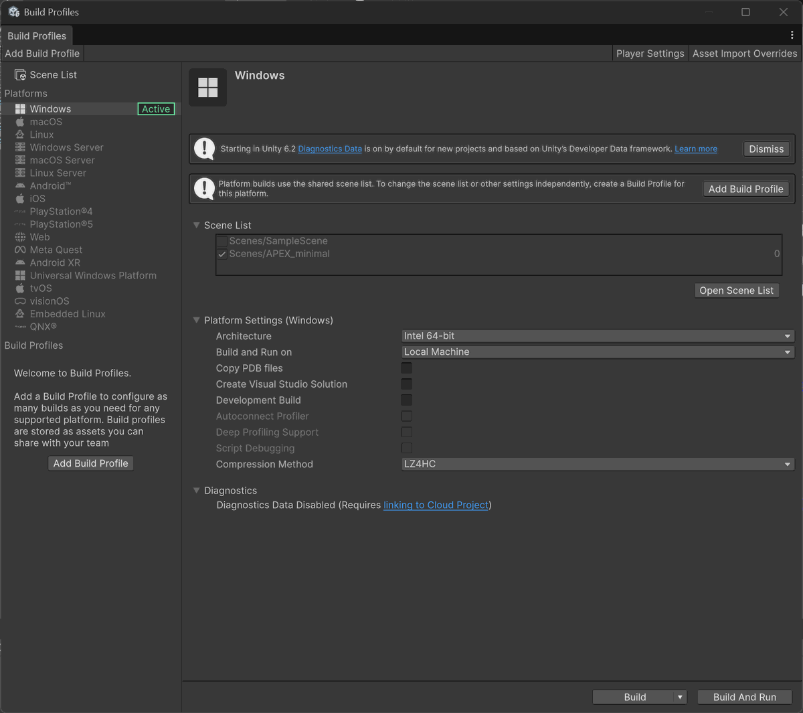

3. **Build** wählen und einen Zielordner angeben, am besten `Build/` im Projektordner. Dieser Ordner ist in `.gitignore` eingetragen und landet nicht im Repository.

Das Programm startet im Vollbild in der nativen Auflösung des Bildschirms, auf dem es läuft. Es muss deshalb auf dem 3D-Display laufen, nicht auf einem zweiten Monitor. Beendet wird es mit Alt+F4.

So sieht die Ausgabe in der Game-Ansicht ohne angeschlossene Kamera aus. Zu sehen sind nur die statischen Objekte:

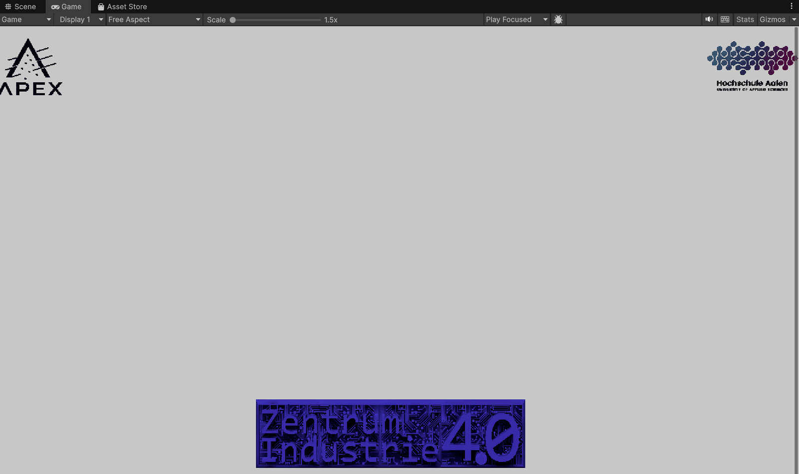

---

## 10. Wo ändere ich was?

| Ich möchte … | Dort ändern |
|---|---|
| mehr oder weniger Tiefenwirkung | Main Camera > G3D Camera > **View Offset Scale** |
| dass etwas anderes auf der Displayoberfläche liegt | Objekt auf z = 2 m schieben oder G3D Camera > **Focus Distance** ändern |
| mehr oder weniger Hintergrund im Kamerabild | OrbbecSurface > **Near Meters** und **Far Meters** |
| ausgefranste Kanten oder „Gummihaut" beheben | OrbbecSurface > **Edge Threshold Meters** |
| eine flüssigere Darstellung | OrbbecSurface > **Decimation** erhöhen, G3D Camera > **Render Resolution Scale** senken |
| ein schärferes Bild | dieselben beiden Werte in die andere Richtung |
| das Kamerabild größer, kleiner oder ungespiegelt | OrbbecSurface > Transform > **Scale** |
| das Kamerabild verschieben oder neigen | OrbbecSurface > Transform > **Position**, **Rotation** |
| die Kamerafahrt abschalten | Main Camera > Häkchen bei **Orbit Loop** entfernen |
| Dauer und Winkel der Kamerafahrt ändern | Main Camera > Orbit Loop > **Zeiten**, **Angle** |
| den Bildausschnitt ändern | Main Camera > Camera > **Field of View** |
| ein anderes 3D-Global-Display verwenden | Main Camera > G3D Camera > **Configuration File**. Die Dateien liegen unter `Packages/3D Global Core/Display Configuration Files/`. |
| Logos oder Schild austauschen oder verschieben | Objekt in der Hierarchy, danach Licht neu backen ([Abschnitt 8](#8-statische-objekte-und-licht)) |
| die 3D-Ausgabe ohne Tiefenkamera testen | Testwürfel aktivieren ([Abschnitt 5](#die-testwürfel)) |
| verstehen, wie aus Kamerabildern eine Fläche wird | `Assets/Scripts/OrbbecSurface.cs`, Methode `BuildMesh` |

---

## 11. Typische Fehler

### „OrbbecSurface: Start fehlgeschlagen. Kamera an USB 3? Orbbec Viewer geschlossen?"

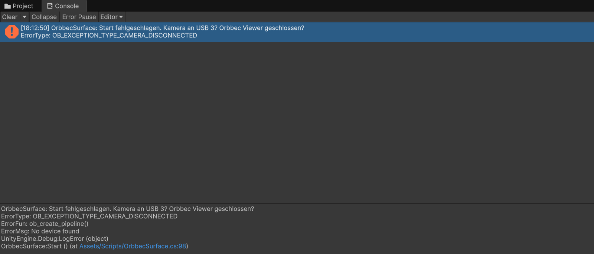

Die Kamera wurde nicht gefunden (`No device found`). Mögliche Ursachen:

- Die Kamera ist nicht angeschlossen oder hängt an einem USB-2-Anschluss.
- Ein anderes Programm hat die Kamera geöffnet, meist der Orbbec Viewer.
- Bei einer virtuellen Maschine: Die Kamera ist nicht an die VM durchgereicht.

Die Szene läuft trotzdem weiter. Es fehlt nur die Live-Oberfläche.

### Weitere Fehlerbilder

| Symptom | Ursache und Abhilfe |
|---|---|
| `DllNotFoundException` für `OrbbecSDK`, oder Texturen und Modelle fehlen | Ohne Git LFS geklont. `git lfs install` und danach `git lfs pull` im Projektordner ausführen. |
| „depthengine.dll fehlt unter …" | Der Ordner `Assets/StreamingAssets/OrbbecSDK/extensions/` ist unvollständig. Meist ebenfalls Git LFS. |
| Das Paket „3D Global Core" fehlt oder meldet Fehler beim Öffnen | Git ist nicht installiert oder es gibt keine Internetverbindung. Danach Unity neu starten. |
| Kein 3D-Eindruck am Display | Der Reihe nach prüfen: Ist `G3D Camera` aktiv? Passt die `Configuration File` zum Display? Läuft das Programm im Vollbild in nativer Auflösung auf dem 3D-Display? |
| Acht kleine Bilder nebeneinander statt eines Bildes | `Should Render Mosaic` ist eingeschaltet. |
| G3D Camera rendert nichts nach einem Wechsel der Render Pipeline | Unter Project Settings > Player > Scripting Define Symbols muss `G3D_URP` stehen. |
| Oberfläche hat Löcher oder fehlt in Teilen | Objekt liegt außerhalb von `Near`/`Far`, oder `Edge Threshold` ist zu klein. Dunkle, glänzende und sehr schräge Flächen liefern unsichere Tiefenwerte. Das SDK setzt solche Pixel auf null, sie fehlen dann in der Oberfläche. |
| Darstellung ruckelt | Im Editor zu erwarten, als Build prüfen. Läuft auch der Build nicht flüssig: `Decimation` auf 2 erhöhen, `Render Resolution Scale` auf 60 senken. |
| Schild oder Logos sind falsch beleuchtet | Licht neu backen, siehe [Abschnitt 8](#8-statische-objekte-und-licht). |
| Im Inspector geänderte Werte sind wieder weg | Sie wurden während Play geändert. Im gestoppten Zustand eintragen und speichern. |

Das Orbbec SDK schreibt eigene Protokolle nach `%USERPROFILE%\AppData\LocalLow\APEX\APEX_minimal\OrbbecSDKLog`.

---

## 12. Datenfluss im Detail

Für alle, die in den Code einsteigen. Live-Tiefenbild einer Orbbec Femto Bolt → farbige Dreiecksoberfläche in Unity → 8 perspektivische Views → brillenloses 3D auf einem 43″-Lentikular-Display (3D Global). Alle Zahlen sind die aktuell gesetzten Werte aus der Szene `Assets/Scenes/APEX_minimal.unity` und der Display-Konfiguration `N8D_43-Inch.txt`.


```mermaid
flowchart TB
    %% ① Kamera
    subgraph S1["① Femto Bolt · Hardware"]
        TOF["ToF-Sensor<br/>sendet moduliertes IR-Licht<br/>misst je Pixel die Korrelation mit dem Rücklicht"]
        RGB["RGB-Sensor<br/>JPEG-Kompression in der Kamera"]
    end

    %% ② Orbbec SDK, nativer Code
    subgraph S2["② Orbbec SDK · nativer Code"]
        DE["depthengine.dll · läuft auf der GPU (Direct3D 11)<br/>Phase → Distanz<br/>Dealiasing mehrerer Modulationsfrequenzen (LUT, JblDealias)<br/>Maskierung: unsichere Pixel + außerhalb FoV → 0<br/>= Depth 640×576 Y16 in mm (NFOV unbinned)"]
        DEC["OrbbecSDK.dll · CPU<br/>MJPG → RGB888 dekodieren (libjpeg-turbo)<br/>= Color 1280×720"]
        SY["OrbbecSDK.dll · FrameSync<br/>Zeitstempelabgleich Depth + Color<br/>nur vollständige FrameSets, 30 fps"]
        DE --> SY
        DEC --> SY
    end

    TOF -->|"USB 3 · Roh-Phasenbilder<br/>mehrere je Tiefenbild"| DE
    RGB -->|"USB 3 · MJPG"| DEC

    %% ③ Worker-Thread (OrbbecSurface.Work)
    subgraph S3["③ Worker-Thread · Kameratakt 30 Hz"]
        AL["AlignFilter → Depth · nativ im SDK<br/>Farbe in die Perspektive der Tiefenkamera umgerechnet<br/>mit Werkskalibrierung: Linsendaten beider Kameras<br/>+ ihre Lage zueinander (Abstand, Drehung)<br/>= Farbe je Tiefenpixel, 640×576"]
        PC["PointCloudFilter · nativ im SDK<br/>Pixel + Entfernung → 3D-Punkt<br/>über die Linsendaten der Tiefenkamera<br/>Format RGB_POINT, linkshändig, y oben (wie Unity)<br/>= 640×576 × (x, y, z, r, g, b) float32"]
        CP["Marshal.Copy → float[] raw (≈ 8.8 MB)<br/>× PositionValueScale × 0.001 → Meter"]
        DC["keine Dezimierung, decimation = 1<br/>Gitter 640×576 = 368 640 Vertices<br/>Vector3[] + Color32[]"]
        TR["Triangulierung je Gittermasche<br/>2 Dreiecke nur wenn alle 4 Ecken<br/>0.8 m ≤ z ≤ 3.8 m und Δz ≤ 0.05 m<br/>maskierte Pixel (0,0,0) fallen so heraus"]
        BK[("MeshData back")]
        AL --> PC --> CP --> DC --> TR --> BK
    end

    SY -->|"FrameSet: Depth Y16 + Color RGB<br/>abgeholt per pipeline.WaitForFrames"| AL

    SW{{"lock: front ⇄ back tauschen<br/>latest wins: nicht abgeholte Frames werden überschrieben"}}

    %% ④ Unity Main-Thread
    subgraph S4["④ Main-Thread · je Renderframe"]
        OL["OrbitLoop auf Main Camera, Order −100<br/>30 s halten → 12 s Schwenk 90° um Pivot 2 m voraus<br/>→ 10 s halten → 12 s zurück<br/>FOV 16° → 30° per SmoothStep"]
        UP["OrbbecSurface.Update()<br/>nur bei frontReady: SetVertices, SetColors, SetIndices<br/>Mesh dynamisch, UInt32-Indizes, feste Bounds"]
        G3U["G3DCamera.Update(), Modus MULTIVIEW<br/>8 Teilkameras aus Pose + FOV der Main Camera<br/>1.6 m vor Fokusebene (focusDistance 2 m × dollyZoom 0.8)<br/>Abstand 6.3 cm, außen ±22 cm, Off-Axis-Projektion"]
        OL -->|"Pose + FOV"| G3U
    end

    CFG[/"N8D_43-Inch.txt<br/>3840×2160, 8 native Views, BGR<br/>Linsensteigung 4/5, ApertureAngle 11.04°<br/>Arbeitsabstand 2 m"/]

    %% ⑤ Szene
    subgraph S5["⑤ Szene"]
        MESH["GameObject OrbbecSurface<br/>pos (0, 0.2, 1.3), rot x 20°<br/>scale (−0.6, 0.6, 0.6) → horizontal gespiegelt<br/>Shader Custom/PointCloudVertexColor:<br/>unlit, Cull Off, sRGB → linear"]
        STAT["Statische Logos, gebackene Lightmaps<br/>APEX_Logo_3D, HS-AA-Logo,<br/>ZentrumIndustrie40schild"]
    end

    %% ⑥ GPU
    subgraph S6["⑥ GPU · URP"]
        V["8 × View-Kamera g3dcam_0 … 7<br/>rendern die Szene<br/>Main Camera selbst: cullingMask = 0"]
        RT["8 × RenderTexture ARGB32 + D16<br/>100 % der Fenstergröße<br/>(Vollbild: 3840×2160)"]
        IL["Interlacing-Pass, ScriptableRP nach Post-Processing<br/>Shader G3D/AutostereoMultiview, Fullscreen-Blit<br/>je Subpixel: view = (3x + (0.8y mod 8) + mstart + sub) mod 8<br/>R, G, B eines Pixels stammen aus verschiedenen Views"]
        V --> RT --> IL
    end

    OUT["43″-Lentikular-Display, 3840×2160<br/>8 Blickzonen → räumliches Bild ohne Brille"]

    BK --> SW
    SW -->|"front"| UP
    UP -->|"≤ 368 640 Vertices<br/>≤ 734 850 Dreiecke"| MESH
    G3U -->|"8 × Pose + Projektionsmatrix"| V
    MESH --> V
    STAT --> V
    CFG -.-> G3U
    CFG -.->|"Subpixel-Layout"| IL
    IL -->|"Backbuffer 3840×2160"| OUT

    classDef hw fill:#e7e5e4,stroke:#57534e,color:#1c1917
    classDef native fill:#f3e8ff,stroke:#7c3aed,color:#2e1065
    classDef worker fill:#e0f2fe,stroke:#0369a1,color:#082f49
    classDef sync fill:#fef9c3,stroke:#a16207,color:#422006
    classDef main fill:#dcfce7,stroke:#15803d,color:#052e16
    classDef scene fill:#f1f5f9,stroke:#475569,color:#0f172a
    classDef gpu fill:#ffedd5,stroke:#c2410c,color:#431407

    class TOF,RGB,OUT hw
    class DE,DEC,SY,AL,PC native
    class CP,DC,TR,BK worker
    class SW sync
    class OL,UP,G3U main
    class MESH,STAT,CFG scene
    class V,RT,IL gpu
```

**Farben:** braungrau = Hardware · lila = nativer Orbbec-Code, auch wenn er im Worker-Thread aufgerufen wird · blau = eigener C#-Code im Worker-Thread · gelb = Übergabe zwischen Threads · grün = Unity Main-Thread · hellgrau = Szene und Konfiguration · orange = GPU-Rendering.

**Worauf es ankommt**

- **Die Tiefe entsteht erst auf dem PC:** Die Kamera liefert Roh-Phasenbilder, also IR-Aufnahmen mit gegeneinander verschobenem Messfenster. Die Distanz steckt erst im Verhältnis mehrerer solcher Aufnahmen. `depthengine.dll` rechnet sie auf der GPU aus und teilt sich diese GPU mit dem 8-View-Rendering von Unity.
- **Was in C# ankommt, ist schon aufbereitet:** Die Werte sind geglättet und maskiert. Die optionalen SDK-Filter (Noise-Removal, Spatial, Temporal, Hole-Filling, Edge-Noise-Removal) liegen unter `StreamingAssets/OrbbecSDK/extensions/filters` bereit, werden aber nicht aufgerufen.
- **Zwei Takte, entkoppelt:** Der Worker produziert im Kameratakt (30 Hz), der Main-Thread lädt pro Renderframe höchstens das jeweils neueste Mesh hoch. Doppelpuffer mit Lock nur für Tausch und Upload.
- **Oberfläche statt Punktwolke:** Die Nachbarschaft kommt direkt aus dem Sensorgitter (organisierte Punktwolke). Deshalb braucht die Triangulierung keine räumliche Suche. Tiefenfenster und Kantenschwelle trennen Vordergrund und Hintergrund.
- **Die Main Camera rendert selbst nichts:** Sie liefert nur Pose und FOV (animiert von `OrbitLoop`). Gerendert wird von 8 Teilkameras, deren Sichtpyramiden sich auf der Fokusebene decken. Der Interlacing-Shader setzt daraus das Display-Bild subpixelweise zusammen.

Die Angaben zu Stufe ② stammen aus Klassennamen und Zeichenketten der SDK-Bibliotheken und aus dem SDK-Log. Der Quellcode der DLLs liegt nicht vor.

### Quellen

- [`Assets/Scripts/OrbbecSurface.cs`](Assets/Scripts/OrbbecSurface.cs)
- [`Assets/Scripts/OrbitLoop.cs`](Assets/Scripts/OrbitLoop.cs)
- [`Assets/Shaders/PointCloudVertexColor.shader`](Assets/Shaders/PointCloudVertexColor.shader)
- Paket 3D Global Core: <https://github.com/ux3d/3DGlobalUnitySDK>, dort `README.md`, `G3DCamera.cs`, `Resources/G3DShaderMultiview.shader` und `Display Configuration Files/N8D_43-Inch.txt`
- Orbbec SDK v2: <https://github.com/orbbec/OrbbecSDK_v2>
- `OrbbecSDK.dll` und `depthengine.dll`: Klassennamen, Zeichenketten und SDK-Log, nur für Stufe ②

